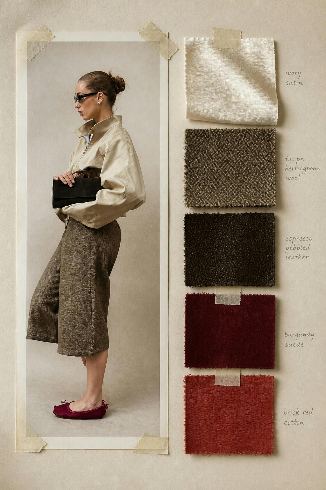
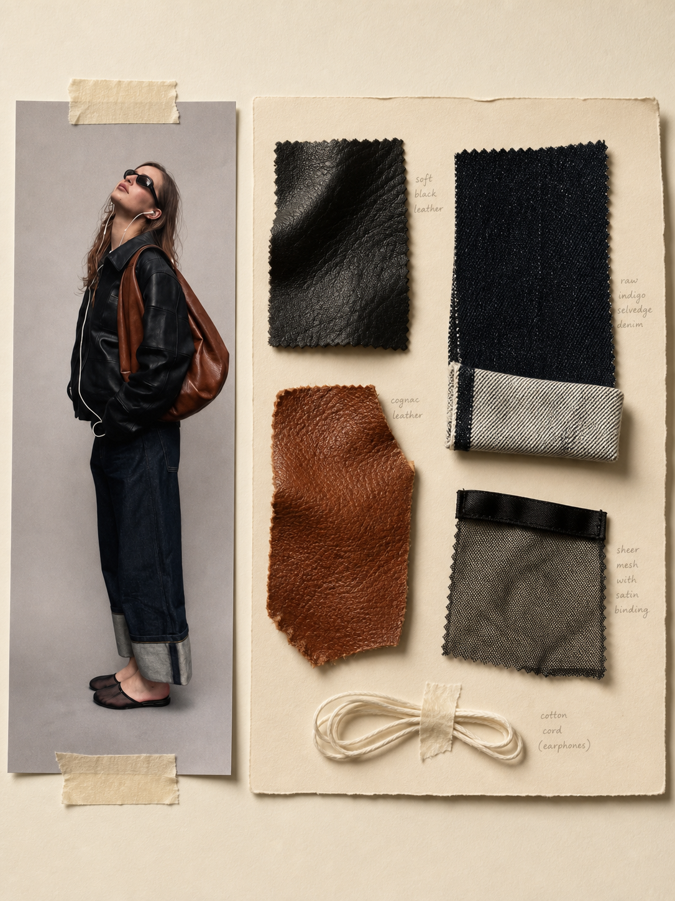

<p align="center">
  <strong>为时装造型建立一套真实、克制、可触摸的材质故事。</strong><br>
  用 Codex 生成具有胶带、纸张、布料与手写批注质感的时装材质灵感板。
</p>

# Fashion Material Board

`fashion-material-board` 是一个面向 Codex 的时装视觉 Skill，用于创建写实的时装材质板、面料样板和造型概念图。

它会将服装造型、颜色与材质整理成一张手工装裱的实体灵感板：左侧是一张完整造型的时装编辑照片，右侧是与造型呼应的布料、皮革、针织、毛绒或羽毛样本。

最终画面强调真实材质、自然阴影和不完美的手工拼贴感，而不是规整的数字拼贴或商品目录。

## 视觉示例

<p align="center">
  
  
</p>

<p align="center">
  <em>从完整造型出发，将颜色、面料和触感整理成具有真实手工拼贴质感的时装材质板。</em>
</p>

> [!NOTE]
> 本 Skill 采用参考图驱动的工作流。使用前必须先上传一张服装、造型或时装参考图；没有参考图时，Skill 会先请求上传，不会直接生成。它还需要 Codex 环境以及可用的图像生成能力。安装完成后，请开启一个新的 Codex 任务，让 Skill 列表重新加载。

## 一张材质板，就是一套造型故事

```text
Fashion Material Board
├── 左侧：完整造型的时装编辑照片
├── 右侧：3–5 种真实材质样本
├── 固定方式：带撕裂边缘的旧胶带
├── 细节：纸张褶皱、布边纤维与自然阴影
└── 注释：少量手写工作室笔记
```

Skill 会先确定造型方向，再选择与造型一致的颜色和面料，避免随机堆叠互不相关的材质样本。

| 阶段 | Skill 负责什么 | 用户可以决定什么 |
| --- | --- | --- |
| 造型方向 | 整理轮廓、场景与时装气质 | 女装、男装、礼服、通勤或其他造型 |
| 色彩故事 | 建立克制且连贯的颜色组合 | 主色、强调色或单色方向 |
| 材质选择 | 选择 3–5 种具有差异的真实材质 | 皮革、针织、棉、羊毛、毛绒或羽毛 |
| 板面构图 | 建立左侧造型、右侧样本的实体拼贴 | 3:4 或 4:5 纵向比例 |
| 视觉细节 | 加入胶带、褶皱、纤维、阴影与批注 | 是否突出某种面料或单品 |

## 开始使用

### 1. 使用 Codex 安装

在 Codex 中直接说：

```text
使用 $skill-installer 安装：
https://github.com/hemengyuncheer-wq/fashion-material-board
```

也可以在终端运行：

```bash
python3 ~/.codex/skills/.system/skill-installer/scripts/install-skill-from-github.py \
  --repo hemengyuncheer-wq/fashion-material-board \
  --path . \
  --name fashion-material-board
```

<details>
<summary>手动安装</summary>

```bash
git clone https://github.com/hemengyuncheer-wq/fashion-material-board.git \
  ~/.codex/skills/fashion-material-board
```

</details>

安装完成后，开启一个新的 Codex 任务。

### 2. 创建第一张材质板

先在对话中上传一张清晰的服装或完整造型参考图，然后发送：

```text
使用 $fashion-material-board，将我上传的参考图转换成一张时装材质灵感板。
```

也可以提供更完整的造型要求：

```text
使用 $fashion-material-board 创建一张纵向时装材质板。

以我上传的造型参考图为主体，保留其中可识别的服装轮廓、颜色、配饰和整体气质。
从图中提取适合的主要面料，并在右侧整理成 3–5 块真实材质样本。
整体使用暖米白纸张、旧胶带、轻微褶皱、自然阴影和少量手写工作室批注。
```

### 3. 继续调整

生成后可以继续提出修改：

```text
让皮革颜色更深，接近 oxblood。
```

```text
减少文字，让材质纹理更突出。
```

```text
保持相同造型，改成冷静的灰黑色材质故事。
```

```text
将整体风格调整为 1990 年代极简奢华女装。
```

## 核心能力

- **造型与材质统一**：服装照片与材质样本使用同一套颜色和面料逻辑。
- **参考图高保真**：优先将原图作为左侧编辑照片直接保留，不根据文字重新绘制人物。
- **人物身份锁定**：保留人脸五官、肤色、表情、视线、发型、妆容和可识别特征。
- **动作与服饰锁定**：保留原始姿势、身体比例、手部位置、镜头角度、裁切、服装版型、颜色、鞋包和配饰。
- **真实材质表现**：突出皮革纹理、针织坑条、织物纤维、毛绒长度和羽毛结构。
- **实体拼贴质感**：保留胶带撕口、纸张卷边、布料毛边和轻微错位。
- **编辑式构图**：使用完整模特造型与克制留白，而不是商品陈列。
- **手写工作室批注**：用少量不完全规整的注释补充颜色和材质信息。
- **纵向视觉输出**：适合 3:4 或 4:5 的时装概念图与展示页面。
- **克制的时装语境**：偏向 1990s–2000s 奢华成衣、档案感与编辑感。

## 推荐提供的信息

| 信息 | 示例 |
| --- | --- |
| 造型或单品 | 酒红色皮裙、羊毛大衣、针织套装 |
| 使用场景 | 秋冬通勤、晚宴、度假或秀场 |
| 主色 | 酒红、炭灰、奶油白 |
| 材质 | 光面皮革、细坑条针织、拉绒羊毛 |
| 风格方向 | 极简、档案感、安静奢华 |
| 画面比例 | 3:4 或 4:5 纵向 |

描述材质时，建议同时写明颜色与表面特征：

```text
deep oxblood smooth leather
charcoal fine-rib knit
long beige faux-fur pile
warm ivory translucent cotton
```

## 视觉原则

- 原始人物照片作为编辑印刷照片直接保留，不重新生成相似人物
- 不改变人脸、表情、视线、发型、动作、身体比例或手部位置
- 不改变服装款式、版型、颜色、图案、鞋包和配饰
- 原图不是全身照时保留原裁切，不补画身体或未展示的服饰
- 暖象牙白或米白色背景
- 从正上方或接近正上方拍摄
- 柔和日光与轻微投影
- 一张纵向的完整造型照片
- 3–5 块具有真实厚度的材质样本
- 部分样本相互覆盖或伸出纸张边缘
- 少量深棕色或黑色手写注释
- 保留足够留白
- 不使用 Logo 或醒目的大号文字

## 不适合的视觉方向

这个 Skill 不用于生成：

- 规则网格式商品目录
- 带按钮或卡片的 UI 页面
- 彩色贴纸式电子手账
- 大量品牌 Logo
- 高饱和度商业海报
- 扁平纯色矩形组成的数字拼贴
- 充满道具和文字的复杂版面

## 仓库结构

```text
fashion-material-board/
├── SKILL.md
├── README.md
├── LICENSE
├── fashion-material-board-01.png
├── fashion-material-board-02.png
└── agents/
    └── openai.yaml
```

- `SKILL.md`：核心工作流、视觉语言与生成约束
- `agents/openai.yaml`：Codex 中显示的名称、说明与默认调用示例
- `README.md`：安装及使用说明
- `LICENSE`：MIT 开源许可证

## Skill 名称

```text
fashion-material-board
```

调用方式：

```text
$fashion-material-board
```

## 使用问题

如果安装后没有看到 Skill：

1. 确认目录位于 `~/.codex/skills/fashion-material-board`。
2. 确认目录中存在 `SKILL.md`。
3. 开启一个新的 Codex 任务，让 Skill 列表重新加载。

## License

本项目采用 [MIT License](LICENSE)。你可以自由使用、复制、修改和分发，但需要保留原始版权声明与许可证文本。
